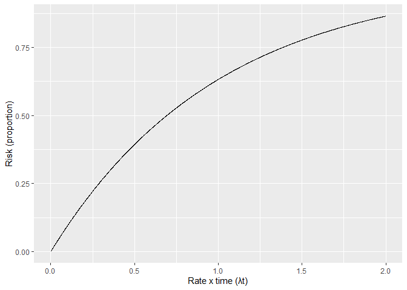
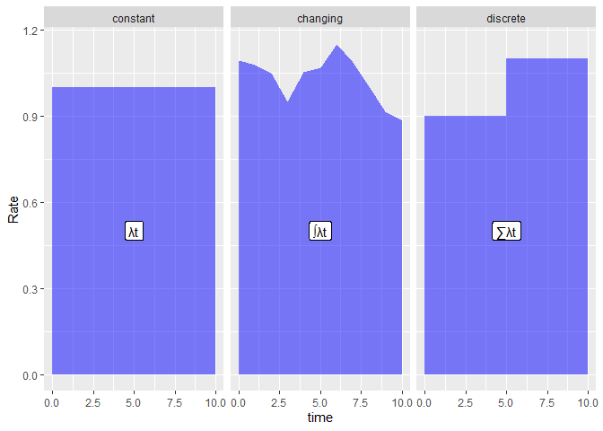
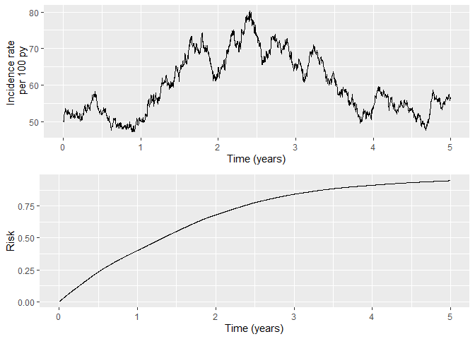
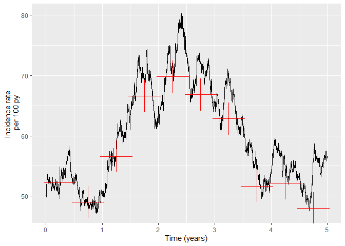
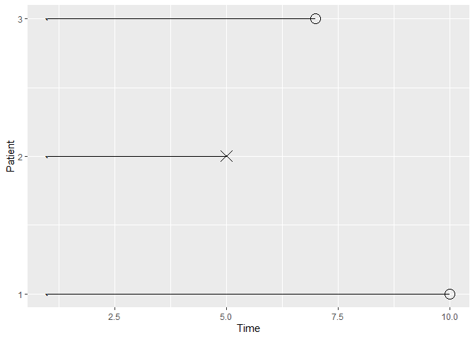
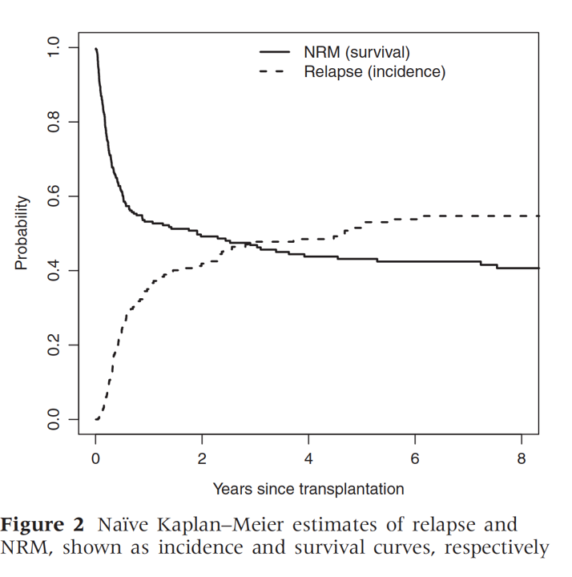
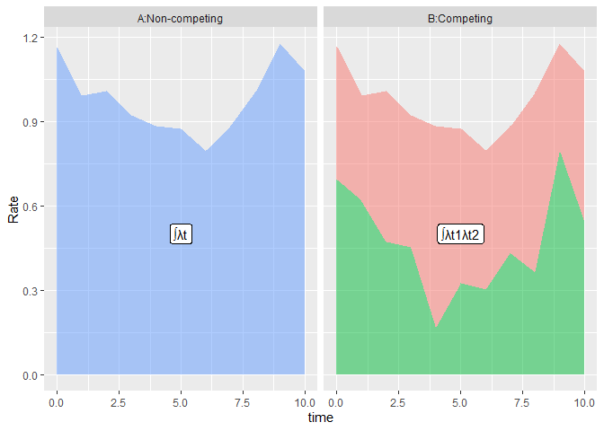
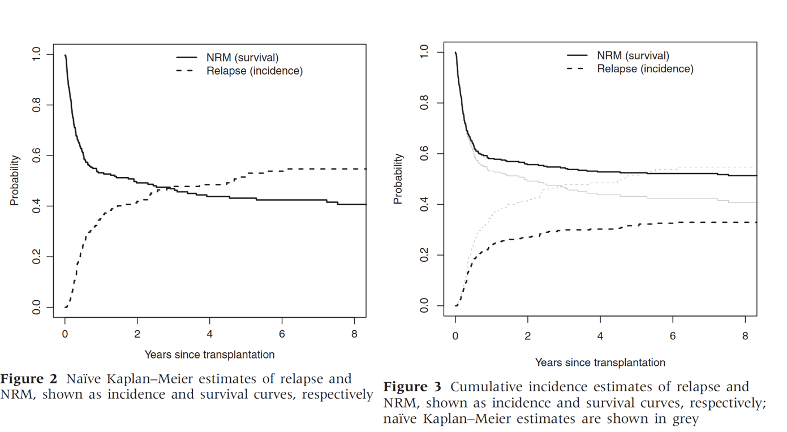

# Competing risks
David McAllister
2025-01-17

## Learning outcomes

- Understand relationship between rates and risks
- Understand concept of competing risks
- Get a feel for the impact of competing risks on outcomes and treatment
  effects

## Overview

- Spend some time on rates and risks

- Proceed to competing risks

- Discussion, equations and interactive plots (via a Shiny app)

## Why there are some equations

- Only if you find these helpful

- Tried hard, but I am not a statistician - some errors possible,
  corrections are welcome

# Scenarios where we might find competing risks

## Cancer

- Trial of a cancer treatment
  - Death from relapse
  - Death from non-relapse related causes

## Cardiovascular

- Trial of a treatment for myocardial infarction (heart attack)
  - Cardiovascular death
  - Bleeding death
  - Non-cardiovascular non bleeding death

## Pregnancy

- Long-term outcomes following chemotherapy - childbirth
  - Childbirth
  - Relapse

## Exercise

Come up with some examples of competing risks

- 
- 
- 

# Rates and risks

## Rates and risks

- Rates - events per person-time
  - Single event per person - incidence rate
  - Otherwise - event rates
- Risk - % or proportion of people experiencing an event

### Synonyms

- Rates - incidence density, force of mortality, force of morbidity,
  hazard rate
- Risk - cumulative incidence

### Uses

- Rates - understanding causation, modelling
- Risks - prediction, magnitude, public health/policy, clinical
  decision-making

## Incidence rate and hazard rate

- Hazard rate
  - mathematics/statistics
  - instantaneous risk
  - Conditional probability
- Incidence rate
  - epidemiology
  - empirical examples
  - Number at risk

Equivalent concepts

# In the absence of competing risks

## 1 to 1 relationship. Constant rates

$$ Risk = 1 - e^{-\lambda t}$$

$$\frac{1}{e^{\lambda t}} , \frac{1}{2.72^{\lambda t}} , \frac{1}{2.72^1} , \frac{1}{2.72^2} , \frac{1}{2.72^3} , \frac{1}{2.72^4}$$

$$\frac{1}{e^{\lambda t}}, \frac{1}{2.72^{\lambda t}}, \frac{1}{2.7}, \frac{1}{7.4}, \frac{1}{20.12}, \frac{1}{54.74}$$

$$\frac{1}{e^{\lambda t}}, \frac{1}{2.72^{\lambda t}}, 0.4, 0.14, 0.05, 0.02$$

100 events per 1,000 person years, 0.1 events per person-year; 10 years;
$\lambda t = 1$

## Risk and rates



## Risk of event at different follow-up periods

| rate | 1 year(s) | 2 year(s) | 3 year(s) | 4 year(s) |
|-----:|----------:|----------:|----------:|----------:|
|  0.1 |      0.10 |      0.18 |      0.26 |      0.33 |
|  0.2 |      0.18 |      0.33 |      0.45 |      0.55 |
|  0.3 |      0.26 |      0.45 |      0.59 |      0.70 |
|  0.4 |      0.33 |      0.55 |      0.70 |      0.80 |

## Exercise 1 Questions

1.  A machine has a constant failure rate of $\lambda = 0.001$ failures
    per year. Calculate the risk of the machine failing within 10 years?
2.  A machine has a constant failure rate of $\lambda = 0.010$ failures
    per year. Calculate the risk of the machine failing within 1 year?
3.  A machine has a constant failure rate of $\lambda = 0.010$ failures
    per year. Calculate the risk of the machine failing within 10 years?
4.  A machine has a constant failure rate of $\lambda = 0.10$ failures
    per year. Calculate the risk of the machine failing within 100
    years?
5.  A machine has a constant failure rate of $\lambda = 0.90$ failures
    per year. Calculate the risk of the machine failing within 10 years?
6.  Why are the answers to question 1 and question 2 the same?
7.  Why is it that for the first three we would have gotten a similar
    answer if we just multiplied the rate per year by the number of
    years, but this is not the case for the last two questions?
8.  Why is the answer to question 2 similar to, but not exactly, ten
    times the answer to question 2?
9.  What assumptions do all five questions make?

## Exercise 1 Answers

1.  A machine has a constant failure rate of $\lambda = 0.001$ failures
    per year. Calculate the risk of the machine failing within 10 years?

``` r
1 - exp(-0.001*10)
```

    [1] 0.009950166

2.  A machine has a constant failure rate of $\lambda = 0.010$ failures
    per year. Calculate the risk of the machine failing within 1 year?

``` r
1 - exp(-0.010*1)
```

    [1] 0.009950166

3.  A machine has a constant failure rate of $\lambda = 0.010$ failures
    per year. Calculate the risk of the machine failing within 10 years?

``` r
1 - exp(-0.010*10)
```

    [1] 0.09516258

4.  A machine has a constant failure rate of $\lambda = 0.10$ failures
    per year. Calculate the risk of the machine failing within 100
    years?

``` r
1 - exp(-0.100*100)
```

    [1] 0.9999546

5.  A machine has a constant failure rate of $\lambda = 0.90$ failures
    per year. Calculate the risk of the machine failing within 10 years?

``` r
1 - exp(-0.9*10)
```

    [1] 0.9998766

6.  Why are the answers to question 1 and question 2 the same? *Because
    $\lambda \times t$ is the same for both.*

7.  Why is it that for the first three we would have gotten a similar
    answer if we just multiplied the rate per year by the number of
    years, but this is not the case for the last two questions? *For the
    first three, the rate and follow-up time are short (ie
    $\lambda \times t$ is small) whereas in the latter two questions it
    is large*

8.  Why is the answer to question 2 similar to, but not exactly, ten
    times the answer to question 2? *Because $\lambda \times t$ is quite
    low for both examples and so the relationship between
    $\lambda \times t$ and risk is close to linear in this range, but is
    not quite linear.*

9.  What assumptions do all five questions make? *There are no competing
    risks. The rates are constant over time*

## Time-varying rates

- Rates varying continuously

$$ Risk = 1 - e^{-\int(\lambda_t dt)}$$ - Rates constant within discrete
time periods

      - 0-3 months 2.5 per 1000 person years
      - 4-12 months 1.0 per 1000 person years

$$ Risk = 1 - e^{- \sum(\lambda_t t_t)}$$

## Area under the curve



## Plot of varying rates and risk



## Example using incidence rate at discrete time periods



## Table for incidence rate at different time periods

| time_period | N_at_risk | duration | events | person_time | rate |
|------------:|----------:|---------:|-------:|------------:|-----:|
|           1 |      1000 |      0.5 |    231 |       442.2 | 52.2 |
|           2 |       769 |      0.5 |    168 |       342.5 | 49.1 |
|           3 |       601 |      0.5 |    149 |       263.2 | 56.6 |
|           4 |       452 |      0.5 |    129 |       193.8 | 66.6 |
|           5 |       323 |      0.5 |     96 |       137.5 | 69.8 |
|           6 |       227 |      0.5 |     65 |        97.2 | 66.8 |
|           7 |       162 |      0.5 |     44 |        70.0 | 62.9 |
|           8 |       118 |      0.5 |     27 |        52.2 | 51.7 |
|           9 |        91 |      0.5 |     21 |        40.2 | 52.2 |
|          10 |        70 |      0.5 |     15 |        31.2 | 48.0 |

## Table for incidence rate at different time periods, continued

| time_period | N_at_risk | duration | events | person_time | rate | Risk  |
|------------:|----------:|---------:|-------:|------------:|-----:|:------|
|           1 |      1000 |      0.5 |    231 |       442.2 | 52.2 | 23.1% |
|           2 |       769 |      0.5 |    168 |       342.5 | 49.1 | 39.9% |
|           3 |       601 |      0.5 |    149 |       263.2 | 56.6 | 54.8% |
|           4 |       452 |      0.5 |    129 |       193.8 | 66.6 | 67.7% |
|           5 |       323 |      0.5 |     96 |       137.5 | 69.8 | 77.3% |
|           6 |       227 |      0.5 |     65 |        97.2 | 66.8 | 83.8% |
|           7 |       162 |      0.5 |     44 |        70.0 | 62.9 | 88.2% |
|           8 |       118 |      0.5 |     27 |        52.2 | 51.7 | 90.9% |
|           9 |        91 |      0.5 |     21 |        40.2 | 52.2 | 93%   |
|          10 |        70 |      0.5 |     15 |        31.2 | 48.0 | 94.5% |

## Exercise 2

What happens to risks and effect estimates for different rates

https://ihwph-hehta.shinyapps.io/competing_risks/

Set “Rate of target event per 100 person-years:” to 10, and the “Rate
ratio for effect of treatment on target event:” to 0.78. Leave the other
settings as they are. Examine the effect of increasing the “Rate of
target event per 100 person-years:”. What impact do these changes have
on the:-

1.  Risk of target events

2.  Relative risk

3.  Absolute risk reduction

4.  What happens to the relationship between the rate ratio and risk
    ratio as you increase the target event rate?

5.  What implications does this have for interpreting rate ratios?

## Exercise 2 - answers

What happens to risks and effect estimates for different rates

https://ihwph-hehta.shinyapps.io/competing_risks/

Set “Rate of target event per 100 person-years:” to 10, and the “Rate
ratio for effect of treatment on target event:” to 0.78. Leave the other
settings as they are. Examine the effect of increasing the “Rate of
target event per 100 person-years:”. What impact do these changes have
on the:-

1.  Risk of target events *It increases, but by less with each
    increase.*

2.  Relative risk *It gets closer to one*

3.  Absolute risk reduction *Over the initial year it gets larger, but
    it is smaller over longer time periods.*

4.  What happens to the relationship between the rate ratio and risk
    ratio as you increase the target event rate? *It tends towards the
    null*

5.  What implications does this have for interpreting rate ratios? *Long
    follow-up times or large rates mean that rate ratios ratios cannot
    be interpreted as risk ratios*

# Censoring


## Example of censoring



## Calculating cumulative incidence (risk)

- Statistical methods to cope with censoring

  - Kaplan-Meier

  $$ S_t = \prod_{i: t_i \le t}(1 -\frac{d_i}{n_i}) $$

  - Nelson-Aalen

$${\tilde H}_{(t)}=\sum_{i: t_i \le t}(\frac{d_{i}}{n_{i}})$$

with $d_{i}$ the number of events at $t_{i}$ and $n_{i}$ the total
individuals at risk at $t_{i}$

- Nelson Aalen - $risk = 1 - e^{-H_{(t)}}$

## Worked example

see Excel spreadsheet “competing_risk_calculation.xlsx”

## Summary: without competing risks

- Rates lie between 0 and infinity
- Risks lie between zero and 1
- Risks can be estimated from rates (and vice versa)
- doubling rate and doubling time have the same effect on the risk
- The relationship between rates and risk is non-linear
- The relationship between time and risk is non-linear
- If the rate ratio is constant over time, the risk ratio will attenuate
  over time
- Rate ratios are **NOT** risk ratios

# Competing risks

## What happens to risk of event if there is a competing event

https://ihwph-hehta.shinyapps.io/competing_risks/

Set “Rate of target event per 100 person-years:” to 10 and “Rate ratio
for effect of treatment on target event:” to 0.78. Leaving the other
settings as they are, gradually increase the event rate for competing
events. NOTE THAT IN THIS SCENARIO THE TREATMENT IS NOT RELATED TO THE
COMPETING EVENT. What impact do these changes have on the:-

- Risk of target events
- Odds ratio
- Relative risk
- Absolute risk reduction

Repeat the exercise varying the target event rate too.

# Estimating risk if there are competing events

## If no censoring

| Relapse | Death | Either | Relapse_Cum | Death_Cum | Either_Cum | Relapse_Risk | Death_Risk | Either_Risk |
|---:|---:|---:|---:|---:|---:|---:|---:|---:|
| 17 | 10 | 27 | 17 | 10 | 27 | 0.017 | 0.010 | 0.027 |
| 19 | 7 | 26 | 36 | 17 | 53 | 0.036 | 0.017 | 0.053 |
| 24 | 8 | 32 | 60 | 25 | 85 | 0.060 | 0.025 | 0.085 |
| 11 | 10 | 21 | 71 | 35 | 106 | 0.071 | 0.035 | 0.106 |
| 20 | 11 | 31 | 91 | 46 | 137 | 0.091 | 0.046 | 0.137 |
| 18 | 10 | 28 | 109 | 56 | 165 | 0.109 | 0.056 | 0.165 |
| 21 | 11 | 32 | 130 | 67 | 197 | 0.130 | 0.067 | 0.197 |
| 27 | 7 | 34 | 157 | 74 | 231 | 0.157 | 0.074 | 0.231 |

## What if there is censoring



## Why


- Dashed line shows KM estimate treating non-relapse death as censoring

- Solid line shows KM estimate treating non-relapse death as censoring

- Double counting censoring if sum these

## Why is it different from censoring due to loss to follow-up

- We assume that such censoring is non-informative

- KM estimates the survival if those who died of a competing risk had
  had same underlying rates as those who did not die from a competing
  risk

## Relationship between rates and risk

$$ Risk_1(t) = \int_0^t{S(t)\lambda_1(t)  dt} $$

$$ S(t) = exp^{- \int_0^t{\lambda_1(t) + \lambda_2(t) dt}} $$

- At any time, survival plus Risk<sub>1</sub> plus Risk<sub>2</sub>
  always equals 1.

- Work through an example in excel

## Area under the curve



## Impact of this graphically



## Cause-specific hazard ratios

- Can also use Cox regression to estimate the cause-specific hazard

- Same model, different interpretation

- Cannot directly translate to risk

- Instead combine the cause-specific hazards using the equation in
  previous slide to estimate the risk of each outcome

  - R packages such as mstate and msm allow combination of different
    models
  - Rely on simulation or bootstrapping to get 95 % confidence intervals

## Modelling cumulative incidence directly

- Can also estimate the cumulative incidence directly using Fine and
  Gray model

- Produces regression coefficients for effect of a predictor on the
  sub-distributional hazard rate

- Unlike the hazard rate from a Cox model this has no natural
  interpretation

## Direction of effect on cause-specific hazard rates

| Prognostic score | Relapse Cox      |     | Death Cox        |     |
|------------------|------------------|-----|------------------|-----|
| Very low         | 1                |     | 1                |     |
| Low              | 1.01 (0.81-1.27) |     | 1.57 (1.25-1.97) |     |
| Medium           | 1.28 (1.03-1.59) |     | 2.01 (1.61-2.52) |     |
| High             | 1.57 (1.25-1.99) |     | 2.68 (2.12-3.37) |     |
| Very high        | 2.67 (2.06-3.47) |     | 3.98 (3.09-5.13) |     |

## Direction of effect on cause-specific hazard rates and risk

| Prognostic score | Relapse Cox | Relapse Fine and Gray | Death Cox | Death Fine and Gray |
|----|----|----|----|----|
| Very low | 1 | 1 | 1 | 1 |
| Low | 1.01 (0.81-1.27) | 0.93 (0.75-1.16) | 1.57 (1.25-1.97) | 1.56 (1.24-1.96) |
| Medium | 1.28 (1.03-1.59) | 1.07 (0.87-1.33) | 2.01 (1.61-2.52) | 1.94 (1.55-2.42) |
| High | 1.57 (1.25-1.99) | 1.17 (0.93-1.48) | 2.68 (2.12-3.37) | 2.48 (1.96-3.12) |
| Very high | 2.67 (2.06-3.47) | 1.55 (1.19-2.02) | 3.98 (3.09-5.13) | 3.27 (2.5; .1.22) |

## What happens to risks and effect estimates if the treatment also affects the competing event

https://ihwph-hehta.shinyapps.io/competing_risks/

Set “Rate of target event per 100 person-years:” to 10, “Rate ratio for
effect of treatment on target event:” to 0.78, “Rate of competing event
per 100 person-years:” to 0.10 and “Rate ratio for effect of treatment
on competing event:” to 1. Examine the effect of changing the “Rate
ratio for effect of treatment on competing event:”. What impact do these
changes have on the:-

- Risk of target events
- Odds ratio
- Relative risk
- Absolute risk reduction

Specifically, what happens to the effect of the treatment on the target
event when the treatment also increases the competing risk. Do you think
that this is generally a good thing?

## Additional references

see
https://docs.google.com/document/d/1eqVzqYM6ozlrt5I_4aqqe6OIR6OV6EJ8G6Tg1lBaQ4Q/edit?usp=sharing

You will also find the link to this on the front-page of
https://github.com/dmcalli2/Advanced_epidemiology_course
